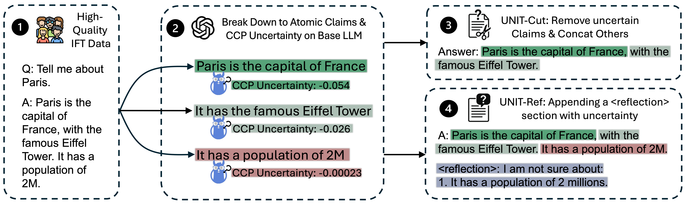

# Balancing Truthfulness and Informativeness with Uncertainty-Aware Instruction Fine-Tuning </a>
UNIT-Ref is a novel IFT paradigm to address hallucination by teaching LLMs to recognize their uncertainty and explicitly reflect it at the end of their responses. This is the official repository for [our paper](https://arxiv.org/abs/2502.11962).



## Setup
First, install python dependences
```console
python -m venv ccp
source ccp/bin/activate
pip install -r requirements_ccp.txt
deactivate
```
and 
```console
python -m venv vllm
source ccp/bin/activate
pip install -r requirements_vllm.txt
deactivate
```

## Prepare the Training Dataset

### To probe the CCP uncertainty given a dataset
To create uncertainty-aware training data, we first need to probe the Claim-Conditioned Probability (CCP) uncertainty of a base model on an Instruction Fine-Tuning (IFT) dataset. This step is crucial as it identifies which parts of the model's responses are uncertain, which will later be used to guide the training process.

For example, to obtain Qwen/Qwen2.5-14B's CCP uncertainty on an IFT dataset (e.g. lfrqa.jsonl), download and put the lfrqa.jsonl dataset into the folder `data_to_probe_ccp` and run:
```console
bash eval_ccp.sh --model_name Qwen/Qwen2.5-14B --get_ccp_from_response datasets/lfrqa.jsonl
```

This command will:
1. Load the specified model (Qwen/Qwen2.5-14B)
2. Process each instruction-response pair in the dataset
3. Extract atomic claims from the responses
4. Calculate CCP uncertainty scores for each claim

You will find the result in `evaluate_database/calibration_result/lfrqa_calibrated_Qwen_Qwen2.5-14B.jsonl`. The output file contains:
- `instruction`: Original instructions from the dataset
- `response`: Model's original responses
- `claim_uncertainty`: a list containing dictionaries recording each claim with their ccp values.

### To classify the information-seeking tasks within a dataset
After obtaining CCP uncertainty scores, we need to identify which instructions are information-seeking tasks (as opposed to creative or reasoning tasks). This classification is important because UNIT methods are specifically designed for information-seeking scenarios where factual accuracy is paramount.

```console
cd src
python instruction_classification.py \
    --instruction_file evaluate_database/calibration_result/lfrqa_calibrated_Qwen_Qwen2.5-14B.jsonl \
    --output_file train_data/lfrqa_calibrated_Qwen_Qwen2.5-14B_labelled.jsonl \
    --llm gpt-4o \
    --batch 20
```

This script will:
1. Analyze each instruction in the dataset
2. Use GPT-4o to classify the task of the instruction is asking.
4. Add classification labels to the dataset

The output file will include an additional field:
- `primary_tag`: primary task/genre of the instruction.   
- `other_tags`: other task/genre of the instruction.

### 1. UNIT-Reflection Dataset
The UNIT-Reflection dataset teaches models to explicitly acknowledge uncertainty by adding reflection sections to their responses. This approach maintains the original response while reflecting on uncertain claims.

To obtain the UNIT-Reflection Dataset, run:
```console
cd src
python make_data_ref.py\
    --input_file train_data/lfrqa_calibrated_Qwen_Qwen2.5-14B_labelled.jsonl \
    --output_file train_data/lfrqa_calibrated_Qwen_Qwen2.5-14B_unit_reflect.jsonl \
```

This script will:
1. Process each information-seeking only instruction from the labeled dataset
2. Identify uncertain claims based on CCP scores
3. Generate reflection sections that explicitly acknowledge uncertainty
4. Create training examples where responses include both the original answer and a reflection on uncertain content

The resulting dataset format includes:
- Original instruction-response pairs
- Added reflection sections highlighting uncertain claims
- Maintained informativeness while increasing honesty

### 2. UNIT-Cut Dataset
The UNIT-Cut dataset takes a different approach by removing uncertain content entirely, creating more conservative but highly truthful responses. This method prioritizes truthfulness over informativeness.

To obtain the UNIT-Cut Dataset, run:
```console
cd src
export OPENAI_API_KEY=xxx
python make_data_cut.py\
    --input_file evaluate_database/calibration_result/lima_calibrated_Qwen_Qwen2.5-14B_labelled.jsonl \
    --output_file train_data/lima_calibrated_Qwen_Qwen2.5-14B_unit_cut.jsonl \
    --llm gpt-4o
```

This script will:
1. Identify uncertain claims in the original responses using CCP scores
2. Use GPT-4o to intelligently remove uncertain content while maintaining coherence
3. Ensure the remaining content flows naturally after uncertain parts are removed
4. Create training examples with conservative, high-confidence responses

The resulting dataset features:
- Shortened responses with uncertain content removed
- Higher truthfulness at the cost of some informativeness
- Maintained response quality and coherence

**Note**: Both UNIT-Reflection and UNIT-Cut datasets require the previous steps (CCP probing and instruction classification) to be completed first, as they depend on uncertainty scores and information-seeking labels to create effective training data.


## Training
We used [Alignment Handbook](https://github.com/huggingface/alignment-handbook/tree/main) to fine-tune our models using the dataset created by UNIT-Ref and UNIT-Cut, the sample training configs containing all our training hyperparameters used can be found in training_configs folder.


## Evaluation for UNIT_REFLECTION Checkpoints

### Step 1: CCP-Based Evaluation
To evaluate the fine-tuned checkpoints with CCP Balanced Accuracy on datasets Biography (bio) or WildHalu, run:
```console
cd src/bash_scripts/eval_ccp.sh
bash eval_ccp.sh --model_name your_checkpoint_path --test_data [bio|wildhalu] --output_files results/qwen25_limalfrqa01_reflect_bio.jsonl
```
- `model_name`: address to your fine-tuned checkpoint_path
- `Output Files`: results/qwen25_limalfrqa01_reflect_bio.jsonl Useful Fields:
    - `instruction`: Instructions from bio or wildhalu dataset.
    - `response`: Response of the target checkpoint.
    - `claim_uncertainty`: Atomic claims and their CCP uncertainty scores.
    - `reflected_answer_claims`: Answer claims that are marked uncertain by the reflection section.
    - `unreflected_answer_claim`: Answer claims NOT flagged by the reflection section.
- `CCP-Based Scores`: CCP Diff, CCP Honesty will be printed out at the end of the script.

### Step 2: Computing Honesty Balanced Accuracy and Truthfulness using FactSCore

```bash
# Here we use limalfrqa01_reflect as an example, other settings can be evaluated similarly
cd src/bash_scripts
bash eval_honesty.sh --input_file results/qwen25_limalfrqa01_reflect_bio.jsonl --output_file results/qwen25_limalfrqa01_reflect_bio_honesty.jsonl --database enwiki
```

This command:
1. Changes to the `src/bash_scripts` directory
2. Runs `eval_honesty.sh` with the following parameters:
   - `--input_file`: Points to the output file from the CCP evaluation (in this case using the Qwen2.5 model's results on the biography dataset)
   - `--output_file`: Specifies where to save the honesty evaluation results
   - `--database`: `enwiki` for FactScore or `wildhalu` for WildFactScore.

The script will:
1. Check if the fact-check database is downloaded, and download it if needed
2. Run fact-checking on the input file
3. Calculate truthfulness and honesty scores
4. Compute the upper bound of the honesty balanced accuracy score

The output will include:
- Truthfulness score (printed as "Overall Acc.")
- Honesty balanced accuracy score (printed as "Macro Avg.")
- Upper bound of the honesty balanced accuracy score, given the ground truth CCP rank and the best possible CCP threshold.

### Step 3: Helpfulness Evaluation

```bash
# Helpfulness evaluation requires OPENAI LLM Access
export OPENAI_API_KEY=xxx
# Here we use limalfrqa01_reflect as an example, other settings can be evaluated similarly
cd src/bash_scripts
bash eval_helpfulness.sh --input_file results/qwen25_limalfrqa01_reflect_bio.jsonl --ref_file results/qwen25_lima_vanilla_bio_atomic_fc.jsonl --output_file results/qwen25_limalfrqa01_reflect_bio_helpfulness.xlsx --dataset bio
```

This command:
1. Changes to the `src/bash_scripts` directory
2. Runs `eval_helpfulness.sh` with the following parameters:
   - `--input_file`: Path to the output file from the CCP evaluation
   - `--ref_file`: Path to the reference file to compare against. Here we use Qwen2.5 fine-tuned on LIMA without UNIT. 
   - `--output_file`: Specifies where to save the helpfulness evaluation results (must end with .xlsx)
   - `--dataset`: bio or wildhalu

The script will:
1. Compare the responses from both files using GPT-4o to evaluate helpfulness
2. Calculate a helpfulness score based on the comparisons
3. Save detailed evaluation results in the specified Excel file

The output will include:
- A helpfulness score (printed as "Score")
- A detailed Excel file containing:
  - The original prompts
  - Responses compared with position swapping
  - The judge's evaluation and reasoning
  - The final verdict for each comparison

## Evaluation for UNIT_CUT checkpoint.
For UNIT_CUT, you don't need to run the CCP evaluation, but need to extract atomic claims first for fact-checking

```bash
# Atomic Claim Extraction requires OPENAI LLM Access
export OPENAI_API_KEY=xxx
# Here, we use limalfrqa01_cut as an example, other settings can be evaluated similarly

# Step 1: Evaluate Truthfulness
cd src/bash_scripts
conda activate vllm
bash eval_truthfulness.sh --model_path PATH_TO_limalfrqa01_cut_CHECKPOINT --setting_name limalfrqa01_cut
```

This command:
1. Changes to the `src/bash_scripts` directory
2. Runs `eval_truthfulness.sh` with the following parameters:
   - `--model_path`: Path to your UNIT_CUT checkpoint
   - `--setting_name`: Name of the setting (in this case "limalfrqa01_cut")

The script will:
1. Inference using `--model_path`, example output file `results/qwen25_limalfrqa01_cut_bio.csv`
2. Extract atomic claims from the model's responses, example output file `results/qwen25_limalfrqa01_cut_bio_atomic.jsonl`
3. Use the English Wikipedia database for fact-checking, example output file `results/qwen25_limalfrqa01_cut_bio_atomic_fc.jsonl`
4. Print truthfulness scores as `Macro Avg.`

```bash
# Helpfulness evaluation requires OPENAI LLM Access
export OPENAI_API_KEY=xxx

# Step 2: Evaluate Helpfulness
bash eval_helpfulness.sh --input_file results/qwen25_limalfrqa01_cut_bio_atomic_fc.jsonl --ref_file results/qwen25_lima_vanilla_bio_atomic_fc.jsonl --output_file results/qwen25_limalfrqa01_cut_bio_helpfulness.xlsx --dataset bio
```

Then runs `eval_helpfulness.sh` which:
   - Compares the UNIT_CUT model's responses with the vanilla model's responses
   - Uses GPT-4o to evaluate helpfulness
   - Outputs detailed comparison results to an Excel file
   - Calculates and displays a helpfulness score


## Datasets
This repository contains 2 types of datasets:
- In datasets folder, we provide:
    1. LIMA and LFRQA's original datasets.
    1. LIMA and LFRQA's dataset with their probed ccp values wrt. Llama3.1-8b and Qwen2.5-14B, uncertain claims and certain claims classified by quantile 75 is also included in these datasets.
- In src/inference_data, we provide WildHalu (500 subset we used) and Biography datasets for evaluation.
